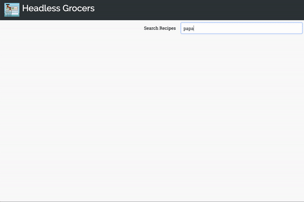

# Headless Grocers

**Disclaimer: This site is not deployed for legal reasons. Use responsibly and**
**at your own risk!**

Let's face it: grocery shopping takes a lot of time and can be daunting. You
might also just ban yourself from going to grocery stores because you can't
control yourself when buying spices and baking supplies. Instacart and other
online shopping tools have made it easier; however, you still have to spend time
searching through recipes to find the perfect match for your day. Painful,
right?

**I've got you covered!** Headless Grocers allows you to search for a recipe
using Yummly's API and keeps your options to the top 10 search results (less
options = less decision fatigue!). Simply choose the right recipe for your day
and with the click of **one** button, add all of the ingredients to your
Instacart basket! From there, all you have to do is glance over your basket and
choose your order time! **Where's the Staples 'that was easy' button?!**

Wow, how did you streamline my life like that? **Ok, there is a catch...** The
technologies used for this site could best be labeled as 'grey matter'. That is,
scraping is a grey area. I entered the grey area for both sites and learned a
lot about how to do it carefully and respectfully along the away. I also learned
that there are consequences to scraping that can be felt throughout a site.
Please refer to the images below for a representation of one of the consequences
you can incur from scraping.

## How To Use:

- Fork and clone

```shell
npm install
npm run build
npm start
```

- Navigate to `localhost:3000` and search for the recipe you want to make!
- Once complete, simply navigate to your Instacart profile, glance over your
  cart, and choose a pickup time! \*\* In order to add items to your personal

<sup>\*<sup> Instacart account, you'll need to create a `creds.js` file and
input your username and email.

## Coming soon to a browser near you...

- Implementation of a Mongo database to store personal recipes is underway.

## Check it out!

Short and sweet frontend preview:


Or see the full process in action!
[](https://youtu.be/GWn7cF-7_qM)

## Technologies Used:

- React Boilerplate
- Puppeteer
- Chrome Headless
- Express
- MongoDB
- Mac OS :wink:

#### Scraping faux pas


The photo on the left is a screenshot of the recipe page from Yummly for "Man Pleasing Chicken". 
The photo on the right is a screenshot taken from the scraper the night before. 
As you can see, the button for "Shop Ingredients" is no longer present. 
This change was not specific to my own computer nor was it region specific. The best hypothesis for this is that the 3rd party site connected to the "Shop Ingredients" button removed access to their resources due to potential compromise (i.e. my scraping). Fortunately, the button has come back so no permanent damage done (yet!!)
